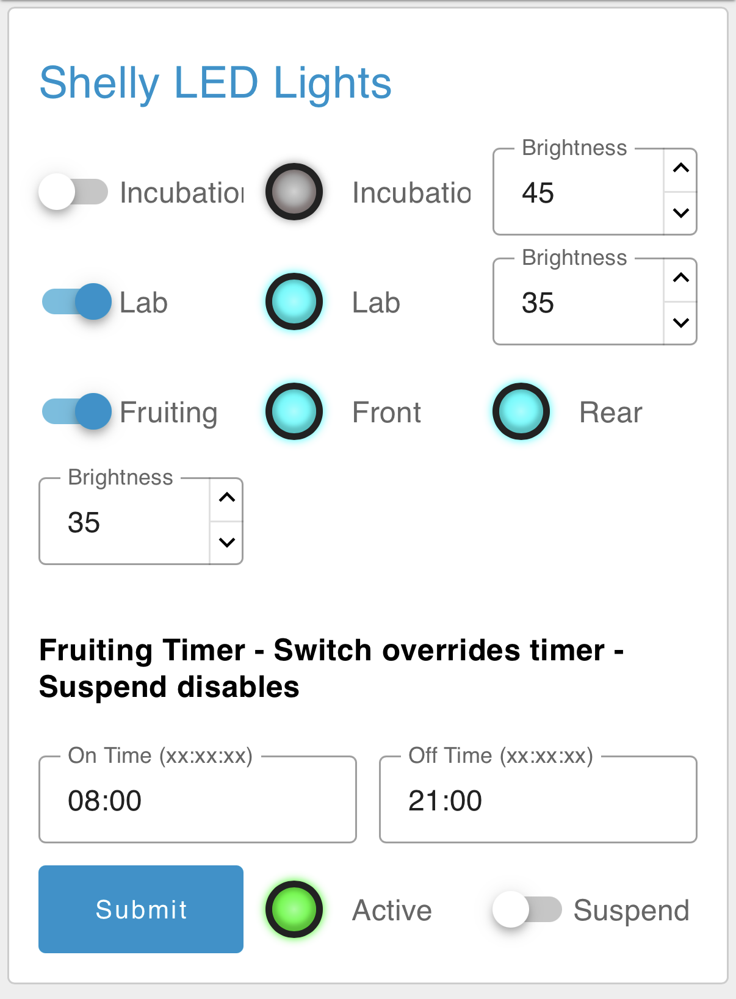
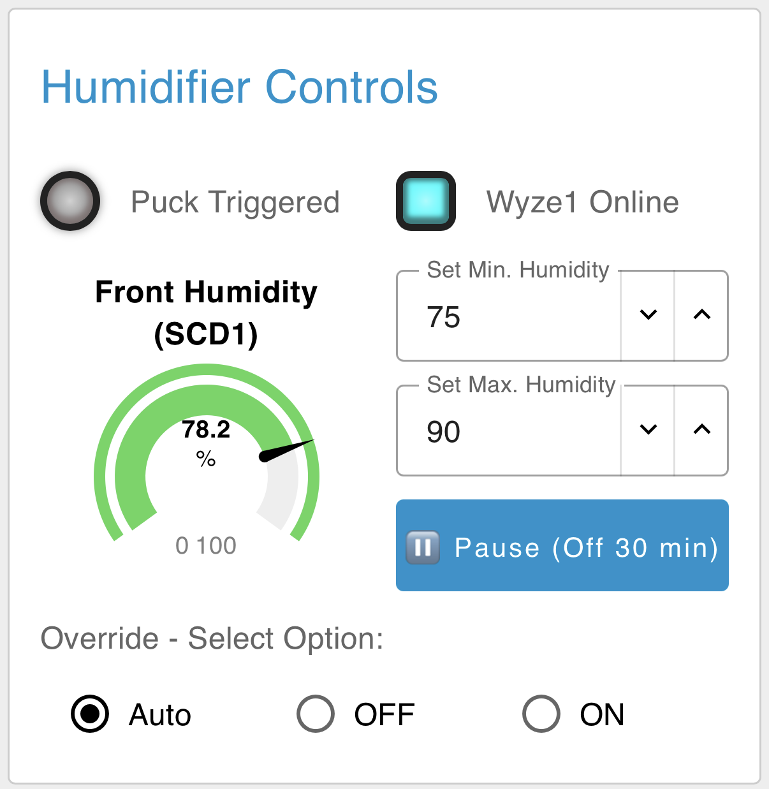
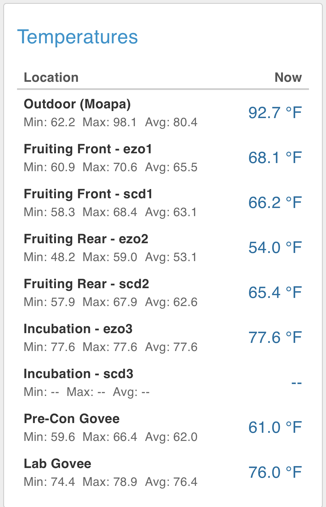
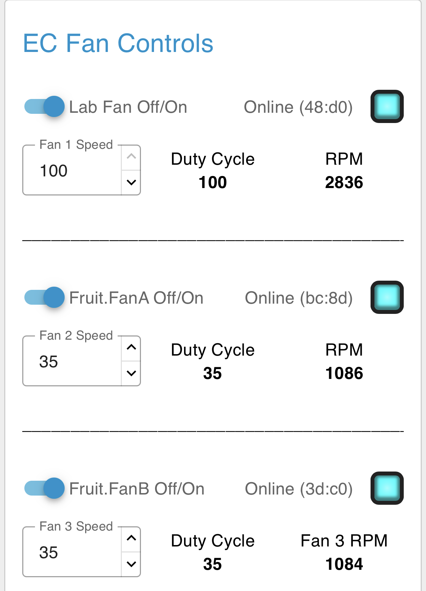
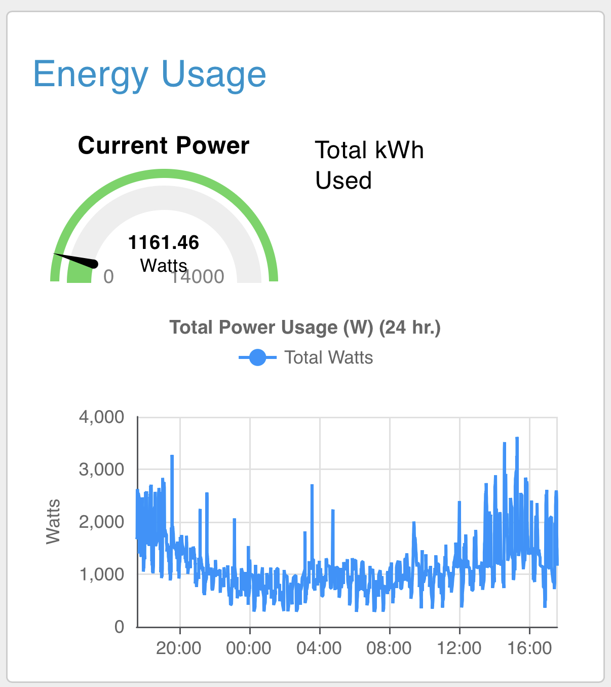
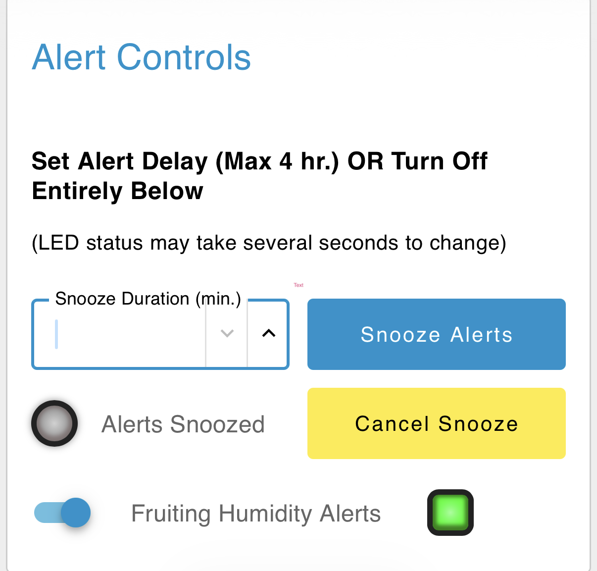
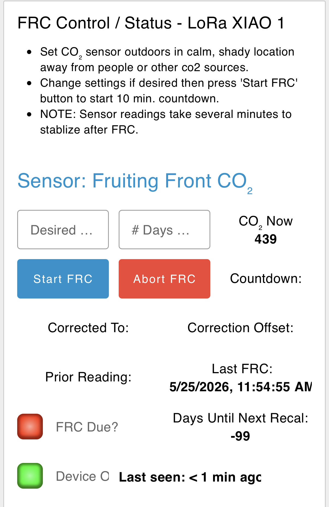

# Mushroom Grow: Node-RED Dashboard 2.0
> 🍄 One of several related projects. See the full list at **[billjuv.github.io](https://billjuv.github.io)**.
> 
The phone dashboard for a mushroom grow operation housed in two shipping containers in Nevada. Part of [Bill's Mushroom Grow Project](https://github.com/billjuv/billjuv.github.io).

It's built with **Node-RED** and **FlowFuse Dashboard 2.0** (`@flowfuse/node-red-dashboard`), *not* the old Dashboard 1.0. It's designed first and foremost to be easy to use on a cell phone.

**Viewing the dashboard:** On the local network, open `http://<IP of the Node-RED computer>:1880/dashboard` in a browser. For remote viewing, we started out with the RemoteRED add-on, which also sends alerts to your phone. These days I reach the dashboard over Tailscale instead, and RemoteRED sticks around for the alerts.

Each section below includes a screenshot, a short description, the devices used, and links to the Node-RED flows that make it work.

---

## What You'll Need

- Node-RED (this was built on v4.1.4)
- FlowFuse Dashboard 2.0 (`@flowfuse/node-red-dashboard`)
- An MQTT broker (Mosquitto here)
- These extra palette nodes (install them from **Manage palette** in Node-RED):
  - `@flowfuse/node-red-dashboard-2-ui-led`
  - `node-red-contrib-influxdb` (plus InfluxDB 1.x for logging and the Energy Billing page)
  - `node-red-contrib-remote` (RemoteRED, for alerts)
  - `node-red-contrib-eztimer` (light timer)
  - `node-red-contrib-countdown` (sensor calibration countdown)
  - `node-red-contrib-simple-gate` (alert on/off)

---

## About the Flows

The flows are organized **by device type**, not by dashboard card. Each brand of sensor or controller has its own flow tab, and link nodes pass the readings over to the tabs that build the dashboard cards. That means some cards, like Humidity and Temperatures, pull data from several flows at once.

All flow files are in the [flows](flows) folder:

- **[ALL-active-flows.json](flows/ALL-active-flows.json)**: Everything in one file. This is the easiest way to see how it all fits together.
- **One file per flow tab**, listed under each dashboard card below.

**Importing:** In Node-RED, open the menu (☰) → **Import** → select the file → **Import** → **Deploy**. Then:

- Point the MQTT broker nodes at your own broker, and adjust topics to match your devices.
- A couple of values were replaced with placeholders: `YOUR_REMOTERED_INSTANCE_HASH` (in the RemoteRED config nodes) and `YOUR_TAILSCALE_IP` (in one MQTT broker). Fill in your own, or delete them if you don't use RemoteRED or Tailscale.
- If you import a single tab, any link nodes that pointed to other tabs will simply come in unconnected.
- If you import more than one file, Node-RED may say some nodes already exist (shared items like the dashboard pages and MQTT broker). Choose to **replace** them rather than importing copies.

### How the Flows Fit Together

| Dashboard card | Built in | Data comes from |
|---|---|---|
| Shelly LED Lights | Shelly-Combined-Switches | (self-contained, includes the timer) |
| Humidity | Puck-Humid-TempF | EZO-HUM-CO2, SDC41-LoRa, Govee-5075, on-site weather station |
| Humidifier Controls | Puck-Humid-TempF | SDC41-LoRa, Watchdogs (EZO backup), Smart-Plugs |
| Expel Fan | Expel-Fan-humid | SDC41-LoRa, Watchdogs (EZO backup) |
| Temperatures | Puck-Humid-TempF | EZO-HUM-CO2, SDC41-LoRa, Govee-5075, on-site weather station |
| CO₂ Sensors | CO2-Table | EZO-HUM-CO2, SDC41-LoRa, SCD41-Calibration-Commands |
| EC Fan Controls | EC-Fan-Controls | (self-contained) |
| Energy Usage | Energy-Usage | (the card title lives in Energy-Billing) |
| Mitsubishi Heat Pump | Mitsu-Heat-Pump | Puck-Humid-TempF (outdoor temp) |
| Alert Controls | Watchdogs | RemoteRED (sends the alerts) |
| CO₂ LoRa Sensors page | SDC41-LoRa | SCD41-Calibration-Commands (status) |
| Sensor Calibration page | SCD41-Calibration-Commands | EZO-Info-Test |
| Energy Billing page | Energy-Billing | InfluxDB |

A few flows work behind the scenes with no card of their own: **VPD-Calculations** (logs vapor pressure deficit to InfluxDB), **RemoteRED** & **Watchdogs** (remote access and alerts), and **Pi-Monitoring-v2** (a Pi health "Control Panel" page).

---
---

## Main Page

My friend with the mushroom grow liked having all the screens below on one main page so he could pull it up on his phone and quickly scroll to what he needed. There are separate "Occasional" pages below for less needed functions.

---

## Shelly LED Lights

Simple on/off switches and dimming levels for four banks of LED light panels. (Overkill, but they were available.) The fruiting area LEDs run on a timer or can be switched manually from the dashboard.

**Devices:** Shelly Plus 0-10V Dimmers

**Flows:** [Shelly-Combined-Switches.json](flows/Shelly-Combined-Switches.json)

---

## Humidity

A chart of humidity from several sensors in the fruiting room, plus outdoor humidity from an on-site personal weather station. Also shows Min, Max, and Current humidity.

> **About that 119%:** No, the Fruiting Rear room isn't wetter than water. That EZO sensor died a while back and has been stuck reading 119% ever since. Just ignore that one.

**Devices:** [SCD41](https://github.com/billjuv/XIAO-LoRa-CO2-monitoring), EZO-HUM

**Flows:** [Puck-Humid-TempF.json](flows/Puck-Humid-TempF.json), with data from [EZO-HUM-CO2.json](flows/EZO-HUM-CO2.json), [SDC41-LoRa.json](flows/SDC41-LoRa.json), and [Govee-5075.json](flows/Govee-5075.json)

---

## Humidifier Controls

Humidity comes from a fogger puck and fan combo, plugged into a smart plug. The plug turns on when humidity drops to the minimum you set and off when it reaches the maximum. The reading comes from a sensor at the *opposite* end of the fruiting room from the humidifier, so the whole room gets there, not just the corner.

There are manual override controls, plus a **Pause** button for harvesting and other times you don't want fog in your face.

**Devices:** Wyze smart plug running Tasmota

**Flows:** [Puck-Humid-TempF.json](flows/Puck-Humid-TempF.json), with data from [SDC41-LoRa.json](flows/SDC41-LoRa.json), [Watchdogs.json](flows/Watchdogs.json), and [Smart-Plugs.json](flows/Smart-Plugs.json)

---

## Expel Fan

A wall fan pushes excess humidity outdoors, and lowers CO₂ levels along the way. It's set up like the humidifier: you set on/off humidity levels from the dashboard. There's also a programmable shut-off delay, so the humidity lingers a bit before the fan clears it out.

Fan speed is set by an AC motor speed controller (not my choice).

*Future plans:* capture that CO₂ instead of dumping it, and pipe it into an adjacent hydroponic trailer.

**Devices:** Smart plug, AC motor speed controller

**Flows:** [Expel-Fan-humid.json](flows/Expel-Fan-humid.json), with data from [SDC41-LoRa.json](flows/SDC41-LoRa.json) and [Watchdogs.json](flows/Watchdogs.json)

---

## Temperatures

Min, Max, Average, and Current temperatures from all sensors, plus outdoors.

**Flows:** [Puck-Humid-TempF.json](flows/Puck-Humid-TempF.json), with data from [EZO-HUM-CO2.json](flows/EZO-HUM-CO2.json), [SDC41-LoRa.json](flows/SDC41-LoRa.json), and [Govee-5075.json](flows/Govee-5075.json)

---

## CO₂ Sensors

Min, Max, Average, and Current CO₂ levels. It also shows when each SCD41 sensor is due for recalibration.

**Devices:** [SCD41 LoRa sensor packs](https://github.com/billjuv/XIAO-LoRa-CO2-monitoring)

**Flows:** [CO2-Table.json](flows/CO2-Table.json), with data from [EZO-HUM-CO2.json](flows/EZO-HUM-CO2.json), [SDC41-LoRa.json](flows/SDC41-LoRa.json), and [SCD41-Calibration-Commands.json](flows/SCD41-Calibration-Commands.json)

---

## EC Fan Controls

On/off and speed controls for the EC fans:

- **Lab Fan:** Moves cool air from the air-conditioned lab (wall unit) into the incubation area.
- **Fruiting Fans (2):** Move cooled air from the pre-conditioning room's mini-split into the fruiting room.

**Devices:** [EC Fan ESPHome](https://github.com/billjuv/EC_Fan_ESPHome) control units

**Flows:** [EC-Fan-Controls.json](flows/EC-Fan-Controls.json)

---

## Energy Usage

A quick look at current and total energy use, plus a chart of the past 12 hours.

Monitoring is done by a Shelly EM Gen3 on the panel that supplies all the power. It uses just one clamp, and the readings are doubled. Not lab-grade, but close enough.

*Elsewhere:* the billing math lives on its own page. See [Energy Billing](#energy-billing) below.

**Devices:** Shelly EM Gen3 Smart Energy Meter with a 50A clamp

**Flows:** [Energy-Usage.json](flows/Energy-Usage.json)

---

## Mitsubishi Heat Pump

Controls and current status of the Mitsubishi mini-split.

**Devices:** [mitsubishi2MQTT](https://github.com/gysmo38/mitsubishi2MQTT) on an ESP8266 NodeMCU board. (Don't bother trying a D1 Mini.)

**Flows:** [Mitsu-Heat-Pump.json](flows/Mitsu-Heat-Pump.json), with outdoor temperature from [Puck-Humid-TempF.json](flows/Puck-Humid-TempF.json)

---

## Alert Controls

Turn off or delay the "humidity is *way* out of range" alerts, which are sent through the RemoteRED app. Useful when you already know, and your phone doesn't need to keep telling you.

**Flows:** [Watchdogs.json](flows/Watchdogs.json)

---

## Occasional Pages

These live on separate dashboard pages, since they're only needed once in a while.

### CO₂ LoRa Sensors

A closer look at the SCD41 LoRa sensor packs, with each unit's CO₂, temperature, and humidity readings in one place. It's handy for checking that everything is reporting in over LoRa.

**Devices:** [XIAO/LoRa CO2 monitoring](https://github.com/billjuv/XIAO-LoRa-CO2-monitoring) sensor packs, OpenMQTTGateway LoRa receiver

**Flows:** [SDC41-LoRa.json](flows/SDC41-LoRa.json), with status from [SCD41-Calibration-Commands.json](flows/SCD41-Calibration-Commands.json)

### Sensor Calibration

Calibrate the SCD41 sensors remotely over LoRa. Pick a sensor from the dropdown, then:

- **Temperature offset:** Enter it in °F; the flow converts it to what the sensor expects.
- **Altitude:** Enter it in feet; the flow converts it to meters. (The SCD41 uses altitude to correct its CO₂ readings, and the Nevada site sits about 1,100 meters lower than my Colorado test bench.)
- **Set / Get:** Send the new values, or read back what the sensor currently has.

The main CO₂ card shows when a sensor is due for recalibration, and this is where you take care of it.

**Devices:** [XIAO/LoRa CO2 monitoring](https://github.com/billjuv/XIAO-LoRa-CO2-monitoring) sensor packs

**Flows:** [SCD41-Calibration-Commands.json](flows/SCD41-Calibration-Commands.json) and [EZO-Info-Test.json](flows/EZO-Info-Test.json)

### Energy Billing

Calculates energy use for today, this week, month-to-date, or any custom date range. It's handy when the power bill needs splitting up.

**Devices:** Shelly EM Gen3 (same as the Energy Usage card)

**Flows:** [Energy-Billing.json](flows/Energy-Billing.json)

---

## Notes

- Nearly everything here talks MQTT, so it could be ported to Home Assistant without too much trouble.
- The dashboard is reached remotely over Tailscale, which is also how I do remote programming. RemoteRED handles the phone alerts.
